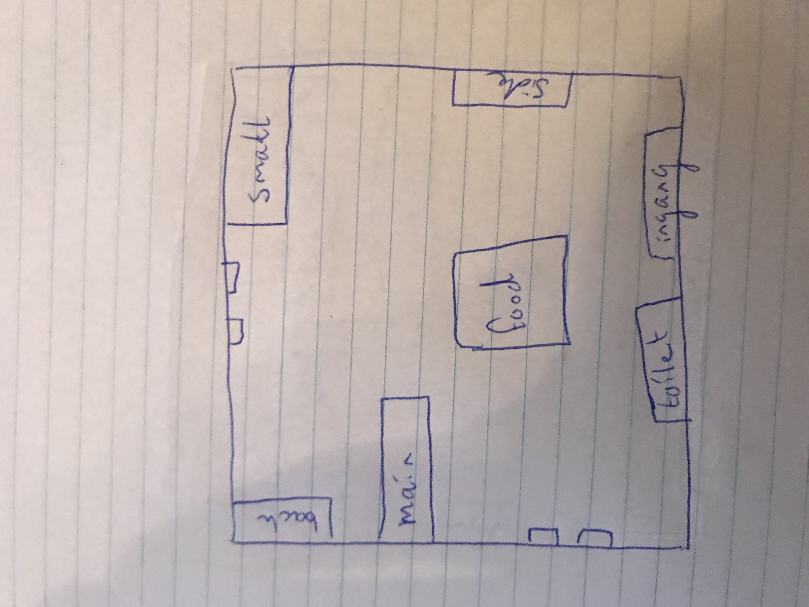
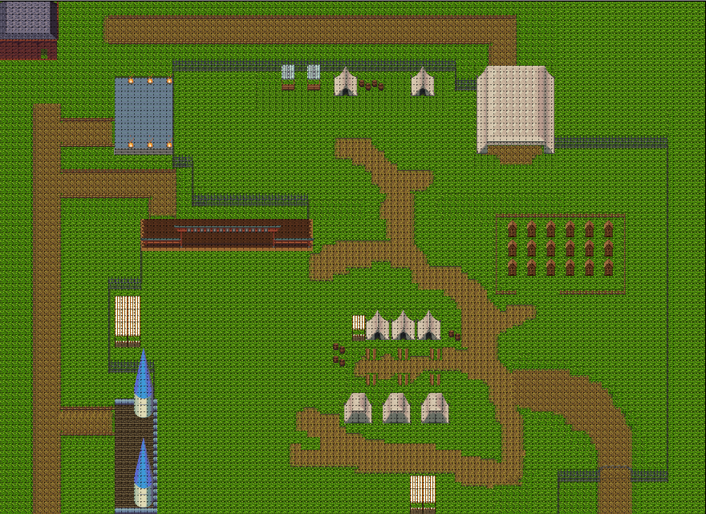
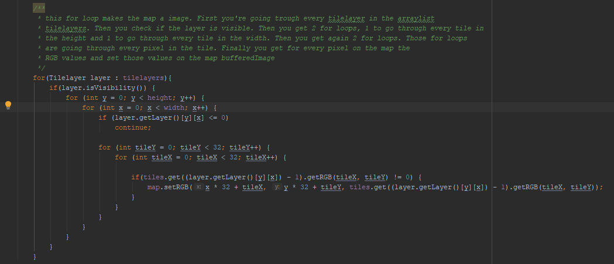
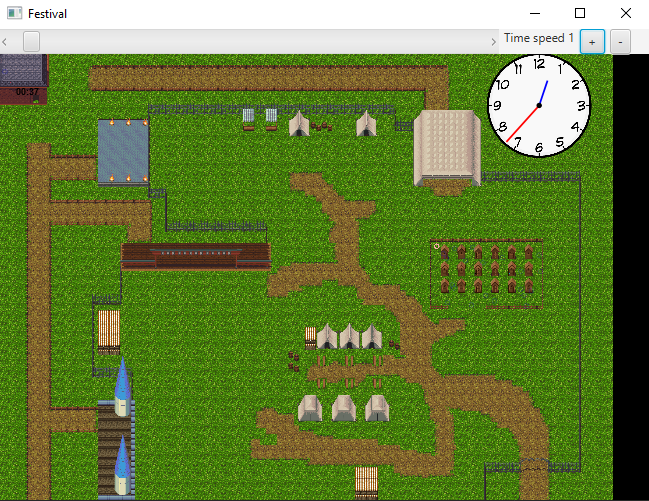

#Portfolio Timo Jenkins
Studentnummer: 2153042

Email: tjr.jenkins@student.avans.nl

Datum: 05-04-2020

##Inhoud
- Week 2
- Week 3
- Week 4
- Week 5
- Week 6
- Week 7
- Week 8
- Week 9
- Aantwoord op de stelling“In het bedrijfsleven wordt steeds meer in software gesimuleerd”
- Applicaties die gebruik maken van het JSON formaat

##Week 2
In week 2 zijn we begonnen met het ontwerpen en implementeren van de agenda modullen.
Als eerste hebben we met zijn alle gekeken wat er voor klassen er moesten komen.
Toen we het klasse diagram gemaakt hadden hebben we de verschillende klasse verdeeld.
Ik heb de taak gekregen om de artist klasse te maken. Ook moest het plan van
aanpak nog worden afgemaakt. Deze week had ik verder nog geen taken gekregen waardoor
ik al snel klaar was met mijn deel.

**Wat is de situatie(context)?**

Ik moest de artist klasse maken.

**Welke keuzemogelijkheden heb je?**

Bij een artiest moest een genre, soort artiest en een afbeelding kunnen worden opgeslagen.
Ik moest dus een beslissing maken hoe ik dit ging opslaan.

**Welke keuze heb je gemaakt?**

Het genre sla ik op als String, de soort artiest sla ik ook op als String en de afbeelding
sla ik op als image.

**Waarom heb je deze keuze gemaakt?**

Bij het genre en een soort artiest is het gemakkelijk om dit op te slaan als String,
ik zou namelijk niet weten hoe ik dit anders beter kan doen. Ook wist ik niets anders om 
de afbeelding op te slaan dan image.

##Week 3
In week 3 heb ik samen met Nathalie de map gemaakt voor ons festival in Tiled.
Ook is aan ons de taak gegeven om de hoofdstukken van het plan van aanpak
die niet voor de proftaak nodig waren maar wel voor P&OC, te maken.

**Wat is de situatie(context)?**

Een tiledmap maken met Tiled

**Welke keuzemogelijkheden heb je?**

We hadden veel keuzemogelijkheden dit keer. Wat voor tile maps we gaan gebruiken, hoe groot we
onze tile map gaan maken en hoe onze tile map eruit komt te zien.

**Welke keuze heb je gemaakt?**

We hebben gekozen voor een tile map van 50 bij 50. We gaan 3 verschillende soorten tile maps gebruiken
en onze tile map komt er als volgt uit te zien: 

dit is het ontwerp wat we op papier hebben gemaakt, vanuit hieruit hebben we de map gemaakt.

**Waarom heb je deze keuze gemaakt?**

Een tile map van 50 bij 50 leek ons wel groot genoeg. We hebben gekozen voor 3 verschillende soorten tile maps
omdat we uit elke tile map iets wilde gebruiken voor ons festival. Het kiezen van het ontwerp van onze map is 
gewoon langzamer hand gekomen. We zijn hiermee gewoon begonnen door te gaan tekenen en kijken hoe het er mooi uit zag.

##Week 4
In week 4 hebben we geprobeerd de map uit te lezen als een json file.
In het begin ging dit nogal stroef doordat het json file vanuit het voorbeeld niet overeen kwam met dat van ons. Na eerst
nog wat onderzoek te hebben gedaan op internet waar het eigenlijk niet duidelijker van werdt ben ik toch maar dingen gaan proberen.
Tijdens het proberen van verschillende dingen werdt het steeds duidelijker. Uiteindelijk is het dus gelukt om een json
uit te laten lezen.

**Wat is de situatie(context)?**

Json file uitlaten lezen

**Welke keuzemogelijkheden heb je?**

Waar moet het uitlezen van de map gedaan worden en hoe gaat dit er uitzien qua ontwerp?

**Welke keuze heb je gemaakt?**

Het uitlezen van de map hebben we in een apparte module gemaakt. Verder hebben we eigenlijk dezelfde klasse als het voorbeeld.
Een klasse mapDemo en Map.

**Waarom heb je deze keuze gemaakt?**

We hebben het uitlezen van de map in een apparte module gedaan zodat dit geen problemen gaf met de agenda module. Zo
kunnen we eerst alles goed laten werken en testen voor we het bij elkaar gaan doen. De klasse die we hebben gekozen is 
eigenlijk grootten deels door het voorbeeld. We hebben het voorbeeld namelijk gewoon aangehouden.

##Week 5
In week 5 hebben we de map nog wat uitgebreid. De projectgroep vond hem namelijk
iets te klein. Ook zijn er nog wat verdere aanpassingen gemaakt op de map. Ook hebben we de code wat verbeterd voor het uitlezen van de file.

Dit is de definitieve map geworden. Met een pad achter de podia, 4 stages, toiletten en een food area.

**Wat is de situatie(context)?**

De map is verbeterd en het uitlezen van de map is verbeterd.

**Welke keuzemogelijkheden heb je?**

Hoe groot moet de map uiteindlijk dan zijn? Gaan de bezoekers en de artiesten door elkaar heen lopen op het festival?
Wat moet er verbeterd worden aan het uitlezen van de map?

**Welke keuze heb je gemaakt?**

De map is nu uiteindelijk 110 bij 80. Dit vonden we allemaal een prima formaat. We hebben gekozen om voor de artiesten
een apart pad achter het festival te maken. Zo lopen de bezoekers en de artiesten niet door elkaar heen. Er is een nieuwe
klasse Tilelayer bijgekomen.

**Waarom heb je deze keuze gemaakt?**

We hebben de grootte van de map gewoon een beetje op gevoel gekozen. We vonden de grootte die we nu hebben er goed uitzien.
Op een festival zie je de artiesten ook niet echt door de bezoekers heenlopen. Daarom hebben we
hier een apart pad voor gemaakt achter de podia langs. Er is een nieuwe klasse Tilelayer aangemaakt zodat er van iedere layer makkelijker
eigenschappen kan worden opgevraagd. Zoals bijvoorbeeld of de tilelayer wel visible is.

##Week 6
In week 6 hebben we een collision en object laag gemaakt in onze map.
Hierna zijn we begonnen aan het implementeren van de path finding.

**Wat is de situatie(context)?**

In deze week moeten we een keuze maken wat voor algoritmen we gaan gebruiken voor de path finding.
In het begin van het project had onze project groep het vooral over het A* algoritmen. Ook moet
er gekeken worden wat er allemaal voor object lagen zijn.

**Welke keuzemogelijkheden heb je?**

- A* star algoritmen gebruiken
- Depth first algoritmen gebruiken
- Breath first algoritmen gebruiken
- Object lagen bepalen

**Welke keuze heb je gemaakt?**

We hebben gekozen voor het breath first algoritmen. Verder hebben we 9 objecten gemaakt in onze object
laag. Voor de main, side en back stage hebben we steeds 2 objecten gemaakt. 1 op het podium voor de 
artiesten en 1 voor het podium voor de bezoekers. Voor de small stage hebben we maar 1 object gemaakt.
Verder hebben we nog een object gemaakt voor de toiletten en de food area.

**Waarom heb je deze keuze gemaakt?**

We hebben gekozen voor de breath first methode omdat we hier ten eerste veel informatie over hebben gehad. 
Ook bleek het A* algoritmen niet goed te werken bij veel NPC's, aangezien ons festival meer
dan 100 NPC's krijgt zijn we dus van deze methode afgestapt. Hierdoor hadden we dus nog de keuze
tussen depth first en breath first. Uit de informatie die we in de les OGP hebben gekregen bleek
dat breath first een beter algoritmen is om de kortste route te krijgen. Daarom hebben we hiervoor gekozen.

We hebben gekozen voor 2 objecten per podium behalve voor de small stage omdat het small stage een
tent is. De artiesten en bezoekers zullen dan samen in de tent staan. Bij de andere podiums zullen
de artiesten op het podium staan en de bezoekers ervoor. Ook hebben we objecten gemaakt voor de 
toiletten en voor de food area zodat de bezoekers hier ook heen kunnen met de path finding.
##Week 7
Deze week was er geen opstart college. Dit is ook de eerste week dat de school dicht is ivm het corona virus.
We hebben deze week via discord vergaderd om te kijken wat de voortgang van ons project is. Verder moet deze week de
path finding af worden gemaakt. Ook moet er van de tiled map één afbeelding van worden gemaakt zodat het
renderen van de map soepel gaat. Vorige week was ik hier
ook al naar aan het kijken, helaas was me het nog niet gelukt om goed te implementeren.

**Wat is de situatie(context)?**

De tiled map beweegt haperig bij het renderen. Dit moet opgelost worden.

**Welke keuzemogelijkheden heb je?**

De enige manier die ik kan bedenken is van de tiled map één afbeelding maken. Doordat je dit doet
hoef je niet elke keer alle layers te tekenen en op te vragen.

**Welke keuze heb je gemaakt?**

Van de tiled map één afbeelding maken doormiddel van setRGB en getRGB. Er zullen misschien nog wel
meer mogelijkheden zijn maar die kon ik niet bedenken.

**Waarom heb je deze keuze gemaakt?**

Verder kon ik eigenlijk niet echt een andere oplossing bedenken. Ik heb gekeken naar wat je allemaal
kon met een afbeelding. Toen zag ik de methodes set- en getRGB. Hier ben ik mezelf dus verder in gaan verdiepen

Dit is het stuk code wat ervoor zorgt dat de map als image wordt opgeslagen. Dit stuk code staat
in de constructor van de klasse. Je hoeft hierdoor maar 1 keer langs de tilelayers te gaan.

##Week 8
Deze week hebben we eigenlijk allemaal steeds samen gewerkt. We hebben op verschillende dagen via
discord in een gesprek gezeten. 1 iemand deelde steeds zijn scherm waarop we allemaal meekeken. Deze
week moesten we er nog voor zorgen dat de NPC's goed op het scherm kwamen en goed de pathfinding gingen
volgen op de juiste tijd.

**Wat is de situatie(context)?**

De NPC's moeten goed op de map komen en de pathfinding gaan volgen.

**Welke keuzemogelijkheden heb je?**
- Wat voor NPC's gaan we gebruiken?

**Welke keuze heb je gemaakt?**

We hebben 2 verschillende poppetjes gepakt van internet.

**Waarom heb je deze keuze gemaakt?**

We hebben 2 verschillende gepakt zodat we voor de artiesten een andere hebben dan voor de bezoekers.

##Week 9
In deze week was ons project al ver af. Er moesten alleen nog wat bugfixes worden gedaan, wat verbeteringen,
en wat extra functionaliteiten. Ik ben deze week bezig geweest met het maken van een soort tijdsbalk
zodat je de tijd op het festival kan aanpassen tijdens de simulatie. Ook heb ik een analoge klok op de map gemaakt.

**Wat is de situatie(context)?**

Er moet een soort tijdsbalk komen en een analoge klok.

**Welke keuzemogelijkheden heb je?**

- Wat voor soort tijdsbalk moet er komen?
- Waar moet de tijdsbalk komen?
- Hoe willen we de tijd precies laten zien?
- Waar moet de klok komen?

**Welke keuze heb je gemaakt?**

Ik heb gekozen om een scrollbar te gebruiken waarmee je de tijd kan veranderen. Deze heb ik bovenaan
 gezet. De klok heb ik rechts boven op de map gezet.

**Waarom heb je deze keuze gemaakt?**

Ik heb de scrollbar gebruikt omdat deze gemakkelijk te gebruiken is. Er hoefde niet veel code geschreven
te worden om dit werkend te maken. De scrollbar heb ik bovenaan de applicatie gemaakt. Dit is een
overzichtelijke plek en in overleg met de projectgroep vond iedereen dit ook prima. Verder heb ik de klok rechts boven 
gezet. Hier was namelijk nog ruimte in de map. Daarnaast heb ik ook nog 2 knoppen gemaakt zodat je de tijd sneller of
langzamer kan zetten. 

Dit is de map geworden met de scrollbar, klok en de knoppen om de tijds snelheid aan te passen.

##Aantwoord op de stelling: “In het bedrijfsleven wordt steeds meer in software gesimuleerd”

Met deze stelling ben ik het eens. Eerst heb ik voor mezelf is nagedacht. Het lijkt mij namelijk dat de stelling juist is.
Er komt steeds betere software, waardoor je steeds meer dingen kunt simuleren. Ook zijn we nu met de huidige proftaak
bezig om een festival te simuleren. Daarnaast is er in de 1e periode ook een hoorcollege geweest waar een 4e jaars
ging vertellen over zijn stage. Hij was op dat moment ook bezig met het maken van een applicatie die gevechts omstandigheden
simuleerde. Zelf heb ik ook ervaring in het bedrijfsleven, aangezien ik al een aantal stages heb gehad. Hier heb ik ook gezien
dat ze applicaties gebruiken om bijvoorbeeld ontwerpen te simuleren, zoals SolidWorks.

Daarna ben ik ook op internet gaan zoeken naar simulatie applicaties. Er bestaan heel veel simulatie applicaties zoals:
SimScale, Simio, RoboLogix en nog veel meer. Ook zijn er bedrijven die gespecialiseerd zijn in het maken van 
simulatie software zoals: Cards PLM Solution of Arena Simulation Software. 

Het is natuurlijk ook een stuk handiger om iets van te voren te simuleren. Hierdoor kan je te weten komen of verschillende
projecten wel haalbaar zijn. Dit bespaard op de lange termijn dan ook kosten. De kans dat een project fout loopt door
ontwerp fouten wordt hierdoor namelijk verminderd. Ook kan je bij een simulatie al zien hoe iets er uit komt te zien. 
Mocht bijvoorbeeld een klant het toch niet goed vinden, zijn er nog niet heel veel kosten gekomen.

Met de stelling: "In het bedrijfsleven wordt steeds meer in software gesimuleerd" ben ik het dus eens. Het is fijn
om dingen van te voren te simuleren zodat een project een grotere kans heeft om te slagen. Aangezien er nog altijd nieuwe
dingen worden uitgevonden en de techniek niet still staat, denk ik dus dat het simuleren d.m.v. software steeds meer wordt.

Bronnen: 
- https://www.cardsplmsolutions.com/nl/producten/simcenter-3d/?gclid=CjwKCAjwg6b0BRBMEiwANd1_SGfO0_VKgJa6zbNgtqS84HshYKndYr1VDhH_FbUdwjdf0ey6teRzjBoC2q4QAvD_BwE
- https://www.capterra.com/simulation-software/
- https://www.arenasimulation.com/

##Applicaties die gebruik maken van het JSON formaat

- Application Programming Interfaces (API)
- Dataservers
- Apple opdrachten applicatie

Deze applicaties maken denk ik gebruik van JSON. Veel API's bieden gegevens aan
in het formaat van JSON. 
Ook dataservers maken gebruik van JSON. JSON wordt in zulke gevallen namelijk gebruikt om
gegevens uit te wisselen tussen bijvoorbeeld een server en een webapplicatie.
Daarnaast is het mogelijk om bij Apple Opdrachten gebruik te maken van JSON. Deze 
applicatie maakt dus ook gebruik van JSON.

Bronnen: 
- https://www.hostinginnederland.nl/help/vragen/wat-is-json-192
- http://home.hccnet.nl/s.f.boukes/html-3/html-329.htm
- https://support.apple.com/nl-nl/guide/shortcuts/apd0f2e057df/ios

